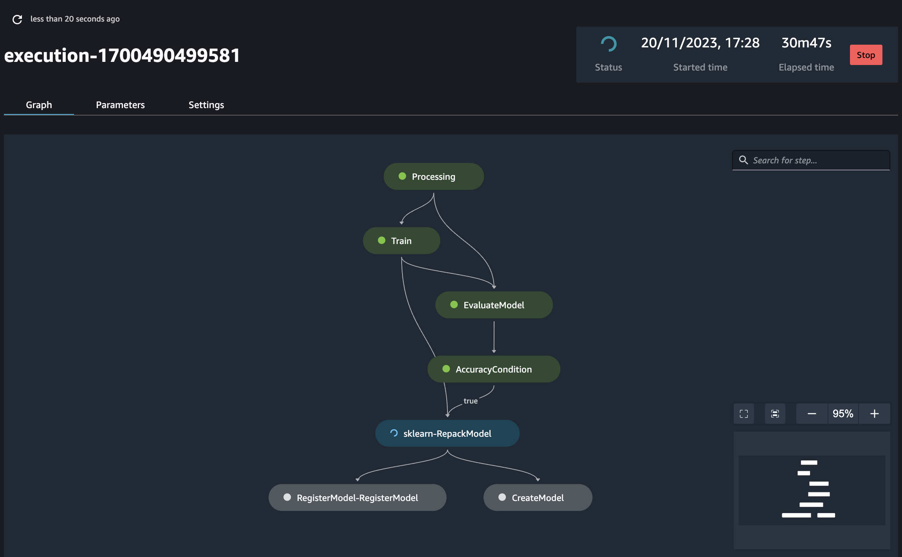
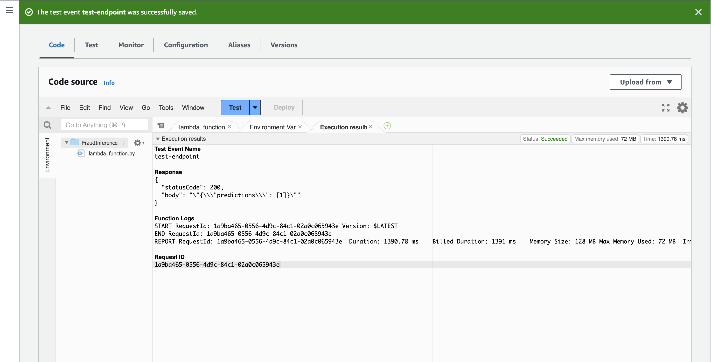

# Fraud Detection in Online Payments with AWS MLOps Pipeline

This project demonstrates how to implement an AWS MLOps pipeline for detecting fraud in online payment transactions using machine learning.

## Getting Started

To get started, you need to download the dataset from Kaggle. You can find the dataset at [Online Payments Fraud Detection Dataset](https://www.kaggle.com/datasets/rupakroy/online-payments-fraud-detection-dataset).

### Prerequisites

- AWS account
- S3 bucket for storing the dataset
- AWS SageMaker for creating and managing the MLOps pipeline
- AWS Lambda functions for various automation tasks

### Installation

1. Download the dataset from the link provided above.
2. Upload the dataset to your S3 bucket.
3. Ensure your SageMaker notebook instance has access to the S3 bucket.

### Pipeline Creation

Run the provided notebook to create the MLOps pipeline in SageMaker, which automates the entire process from data preprocessing to model deployment.



### Lambda Functions

There are three Lambda functions involved in this project:

1. **Trigger Pipeline Execution**: Trigger the pipeline with the required parameters. Sample event object:

```json
{
  "pipeline": "your-pipeline-name",
  "parameters": [
    {
      "Name": "InputData",
      "Value": "s3-data-uri"
    },
    {
      "Name": "ProcessingInstanceCount",
      "Value": "1"
    },
    {
      "Name": "ProcessingInstanceType",
      "Value": "ml.m5.large"
    },
    {
      "Name": "TrainSplitPercentage",
      "Value": "0.7"
    },
    {
      "Name": "ValidationSplitPercentage",
      "Value": "0.10"
    },
    {
      "Name": "TestSplitPercentage",
      "Value": "0.20"
    },
    {
      "Name": "FeatureStoreOfflinePrefix",
      "Value": "fraud-feature-store-1700426733"
    },
    {
      "Name": "FeatureGroupName",
      "Value": "reviews-feature-group-1700426733"
    },
    {
      "Name": "TrainInstanceType",
      "Value": "ml.c5.2xlarge"
    },
    {
      "Name": "TrainInstanceCount",
      "Value": "1"
    },
    {
      "Name": "MaxDepth",
      "Value": "7"
    },
    {
      "Name": "LearningRate",
      "Value": "0.16466967895118775"
    },
    {
      "Name": "NEstimators",
      "Value": "119"
    },
    {
      "Name": "MinChildWeight",
      "Value": "6"
    },
    {
      "Name": "Subsample",
      "Value": "0.9758503388962246"
    },
    {
      "Name": "ColsampleByTree",
      "Value": "0.5146998846523689"
    },
    {
      "Name": "MinRecallValue",
      "Value": "0.99"
    },
    {
      "Name": "ModelApprovalStatus",
      "Value": "PendingManualApproval"
    },
    {
      "Name": "DeployInstanceType",
      "Value": "ml.m5.large"
    },
    {
      "Name": "DeployInstanceCount",
      "Value": "1"
    }
  ]
}
```

2. **Endpoint Deployment**: Deploy the model as an endpoint for real-time inference after the pipeline execution is complete. Sample event object:

```json
{
  "ModelName": "your-created-model-name"
}
```

3. **Inference Requests**: Send requests to the deployed model endpoint. The data should be preprocessed in the same manner as during training. Sample event object:

```json
{
  "EndpointName": "your-endpoint-name",
  "type": 2,
  "amount": -1.109323,
  "oldbalanceOrg": -0.309948,
  "day": 0
}
```


## Usage

To trigger the pipeline, deploy the model, and send inference requests, you can use the corresponding Lambda functions. Ensure to pass the event objects with the correct parameters.

## Authors

* **Katuula Joel**

## Acknowledgments

* Kaggle for providing the dataset.
* AWS for the MLOps services.
```